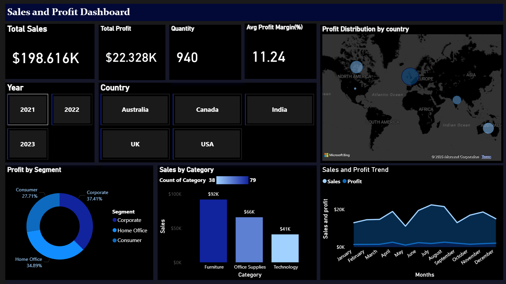
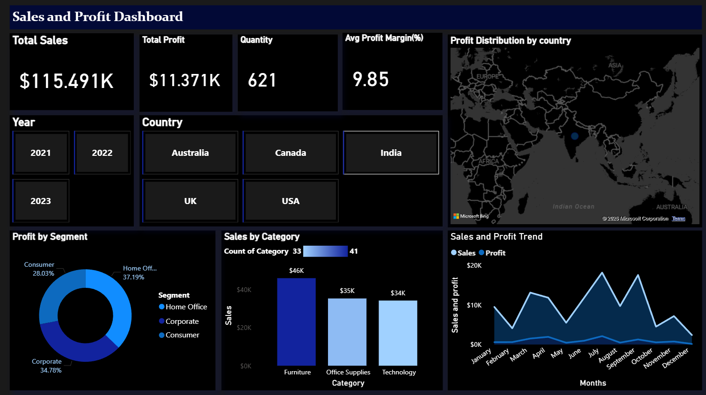

# 📊 Sales & Profit Analysis Dashboard

## Overview

This project is an interactive Power BI dashboard analyzing sales performance, profit trends, and regional insights.

The dashboard allows filtering by **Year** and **Country** to dynamically update KPIs and charts.

## Key Features

* Total Sales, Profit, Quantity KPIs
* Average Profit Margin calculation
* Profit distribution by country (Map visual)
* Profit by segment (Donut chart)
* Sales by category comparison
* Monthly Sales & Profit trend analysis
* Interactive Year and Country slicers

## Tools Used

* Power BI
* DAX
* Data Modeling

## Key Insights

* Corporate segment contributes the highest profit share.
* Furniture category drives highest sales.
* Average profit margin is ~10%.
* Seasonal trends visible in monthly analysis.

## 📸 Dashboard Preview
### Overall Dashboard

### Filtered View

### Filtered View by Country

## Author

Rahul – Aspiring Data Analyst
